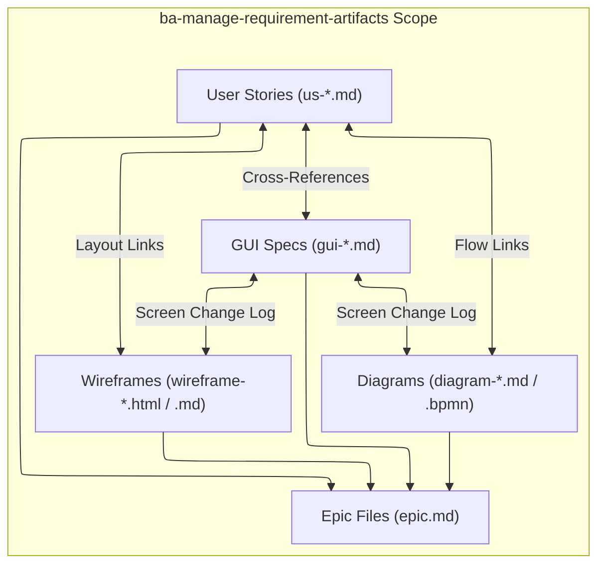

# Requirement Artifact Management Skill

## Purpose & Scope

Maintain `.agent-artifacts/requirements/` as the BA delivery workbench. Create backlog-ready user stories (`us-*.md`), implementation-ready GUI specifications (`gui-*.md`), and canonical epic files (`epic.md`).

This skill is the **Single Source of Truth (SSOT)** for deliverable placement and folder indexing rules under `.agent-artifacts/requirements/output/`.

---

## Artifact Traceability & Structure Scope

This diagram illustrates the artifact relationships and indexing structure managed within `.agent-artifacts/requirements/output/`:



### Incoming Handoffs:

- **From `ba-functional-decomposition` / `functional-decomposition.md`**: Reads `.agent-artifacts/requirements/output/functional-decomposition.md` to extract target `<epic-slug>` rows (story title, actor, user goal, slicing rationale), then authors `<epic-slug>/epic.md`, physical `us-*.md` user stories, and any needed `gui-*.md` screen specs — determining the GUI Spec CRUD Action itself, since the decomposition file does not carry GUI actions or links.
- **From `ba-generate-wireframe`**: Receives rendered wireframe mockups $\rightarrow$ authors or updates cumulative `gui-<screen>.md` specifications and links them to user stories.
- **From `ba-generate-diagram`**: Receives process/state flow diagrams $\rightarrow$ embeds diagram links into user story reference tables and GUI screen change logs.

### Outgoing Handoffs:

- **To `ba-clarify-api-requirements`**: When backend endpoint contracts or schemas are required.
- **To `ba-generate-diagram`**: When visual workflow or state transition diagrams are required.
- **To `ba-sync-backlog`**: When backlog-ready items are ready for Jira or Azure DevOps sprint synchronization.
- **To `ba-update-project-knowledge`**: When stable domain concepts emerge to distill into `.agent-artifacts/project-knowledge-base/`.

---

## Ownership (SSOT for `.agent-artifacts/requirements/`)

This skill manages files within the canonical folder hierarchy:

```text
.agent-artifacts/requirements/
|-- index.md
|-- input/                          <-- Raw client intake, briefs, tickets, screenshots
|   `-- index.md
`-- output/                         <-- Canonical delivery hierarchy (using frontmatter status: draft / refinement / signed-off)
    |-- index.md                    <-- Master index linking epics & root artifacts
    |-- vision-scope.md             <-- Overall product vision & scope
    |-- functional-decomposition.md <-- Overall capability breakdown
    |-- elicitation/                <-- Project-wide discovery notes & interview sessions
    |   |-- index.md
    |   `-- elicitation-<session-slug>.md
    `-- <epic-slug>/                <-- Epic delivery folder
      |-- epic.md                 <-- Canonical epic definition and child artifact links
        |-- elicitation-<session-slug>.md  <-- Epic discovery & Q&A notes
        |-- <user-story-id-or-slug>.md
        |-- gui-<screen-slug>.md
        |-- api-<api-slug>.md
        |-- wireframes/
        |   |-- wireframe-<screen-or-flow-slug>.html
        |   `-- wireframe-<screen-or-flow-slug>.md
        `-- diagrams/
            |-- diagram-<diagram-slug>.md
            `-- diagram-<diagram-slug>.bpmn
```

### Reference Guidelines & Templates

- **User Stories**: `assets/user-story-template.md` & `references/user-story-guidelines.md`
- **Definition of Ready (DoR)**: `references/definition-of-ready.md`
- **GUI Specs**: `assets/gui-specification-template.md` & `references/gui-specification-guidelines.md`
- **Epic Placement & Navigation**: `assets/epic-template.md` & `references/artifact-guidelines.md`
- **Vision & Scope**: `assets/vision-scope-template.md` � Use when authoring `output/vision-scope.md` for a new project or updating it after a scope pivot. Populate from the signed-off elicitation session.

---

## Workflow

1. **Read Current State & Vision-Scope Gate**:
   - **Vision-Scope Prerequisite**: Before drafting any epic, story, or GUI spec, check whether `.agent-artifacts/requirements/output/vision-scope.md` exists.
     - If this is a **new project** (no `vision-scope.md` present): author it now using `assets/vision-scope-template.md`, populated from the signed-off elicitation session passed by `ba`. Do not author epics or stories until `vision-scope.md` is written and confirmed.
     - If this is an **ongoing project** with an existing `vision-scope.md`: read it to establish the current scope baseline before proceeding.
   - Before drafting anything, read the target epic folder's current `epic.md`, its parent navigation index, and any existing `<user-story-id-or-slug>.md` / `gui-<screen-slug>.md` files, or confirm the epic folder does not exist yet for a brand-new epic.
   - For each confirmed slice, determine whether a matching story/GUI spec already exists (`UPDATE`) or not (`CREATE`), and note existing story IDs so new ones continue numbering without collision or renumbering.

2. **Consume Decomposed Slices & Mandatory Elicitation Gate**:
   - Read the target `<epic-slug>` section from `functional-decomposition.md` (or confirmed slicing handoff) to retrieve pre-sliced stories and actor goals. Determine GUI Spec CRUD actions and screen linkage yourself — they are not part of the decomposition file.
   - **Pre-Authoring Elicitation Gate (Universal Invariant)**: Before creating or modifying any vision & scope (`vision-scope.md`), functional decomposition (`functional-decomposition.md`), epic (`epic.md`), user story (`us-*.md`), or GUI specification (`gui-*.md`), verify that an interactive clarification batch (`vscode_askQuestions`) for that specific target was presented and answered in the active conversation turn, or that the user explicitly directed `"skip elicitation"` / `"use defaults"`. If neither condition is met, HALT file creation/editing and return that target to `ba-elicit-requirements`. Imperative user commands (_"start"_, _"create"_, _"write"_, _"update"_, _"modify"_, _"generate"_) NEVER waive this requirement.

3. **Present Authoring Plan for Approval & Cadence**:
   - Before creating, editing, or overwriting any file, contribute this skill's Epic, User Story, and GUI Specification rows to the orchestrator's combined artifact plan. The combined plan also carries Wireframe and Diagram rows owned by `ba-generate-wireframe` and `ba-generate-diagram`.

   | Artifact Type                           | Action                         | Owner                             | File Path               | What Changes / Dependency                                                                                         |
   | --------------------------------------- | ------------------------------ | --------------------------------- | ----------------------- | ----------------------------------------------------------------------------------------------------------------- |
   | Epic \| User story \| GUI specification | `CREATE` \| `UPDATE` \| `NONE` | `ba-manage-requirement-artifacts` | `<epic-slug>/<file>.md` | `<new epic / new story / new AC / new RAID row / new GUI component / supporting wireframe or diagram link, etc.>` |
   - Do not write any file until the user confirms the combined plan and authoring cadence (**Iterative One-by-One Review** recommended vs **Batch Generation**).
   - In **Iterative One-by-One Review** mode, author the foundational container (`epic.md`) and visual anchor (`gui-*.md`), wait for user review, then author stories sequentially, pausing for review after each story. Do not create a wireframe or diagram yourself; route those approved rows to their owning skills.

3a. **Semantic Testability Gate**:

- Before writing or updating acceptance criteria, read the authoritative [Definition of Ready](./references/definition-of-ready.md) and [User Story Guidelines](./references/user-story-guidelines.md).
- Extract business predicates from every `Given`, `When`, `Then`, and `And` step. Flag qualifiers such as `valid`, `complete`, `trustworthy`, `generic`, `inconclusive`, `available`, `successful`, `appropriate`, `fast`, `quick`, `cleanly`, `properly`, `reliable`, `confident`, and `suitable` when their meaning is not observable from the story or an authoritative linked source.
- If a qualifier is defined locally, record its boundary conditions, allowed values, or classification rule in a Definitions, Rules, Glossary, or equivalent section. If it is defined elsewhere, link the authoritative source.
- For fallback, precedence, classification, or routing behavior, add a decision table with `Input state | Observable condition | Selected path | Expected outcome`.
- Do not save or certify the artifact while an unresolved semantic qualifier or routing rule remains. Stop and ask for a decision with a recommended option and alternatives.

4. **Folder & Naming Conventions**:
   - Use stable lowercase hyphenated slugs (e.g., `epic-01-user-auth`, `us-001-customer-login.md`, `gui-order-detail.md`).
   - Place GUI specs, wireframes (`./wireframes/`), and diagrams (`./diagrams/`) in the same epic folder as their related user stories.

5. **Draft Artifacts with 3-Tier ACs, RAID Logs & UI Component Tables**:
   - Apply 3-tier Gherkin ACs and structured RAID logs for stories, and 4-column tables (`UI Element`, `Component Type`, `Description`, `Validation`) for GUI specs.
   - Keep acceptance criteria behavior-level and deterministic. Put detailed field rules in GUI specs and use the semantic testability gate for business predicates and fallback decisions.

6. **Synchronize Navigation & Relative Links**:
   - Run `powershell -NoProfile -File skills/ba-manage-requirement-artifacts/scripts/sync_indexes.ps1` (or let the post-write hook execute it) to deterministically synchronize `epic.md` inventories, child indexes, and `output/index.md` without consuming LLM tokens.
   - Confirm both scripts exist before execution. If either is unavailable, stop and report the tooling gap; do not claim synchronization or validation completed.
   - Run `powershell -NoProfile -File skills/ba-manage-requirement-artifacts/scripts/validate_requirements.ps1 --all --dor --semantic --terse` to verify link resolution, Scrum DoR compliance, and semantic acceptance-criteria testability with ultra-compact 1-line findings.

---

## Core Tooling (in `scripts/`)

Directly invoke these utilities using the exact CLI syntax below; do not inspect script source code unless diagnosing an execution error:

| Utility                         | Script Command                                                                                                                                              | Description                                                                                                                                                                                                                                                                                        |
| ------------------------------- | ----------------------------------------------------------------------------------------------------------------------------------------------------------- | -------------------------------------------------------------------------------------------------------------------------------------------------------------------------------------------------------------------------------------------------------------------------------------------------- |
| **Index Synchronizer**          | `powershell -NoProfile -File skills/ba-manage-requirement-artifacts/scripts/sync_indexes.ps1 --root "<repo-root>"`                                          | Auto-syncs `epic.md`, child indexes, and parent navigation with zero token cost. `--root` accepts target repository path.                                                                                                                                                                          |
| **DoR, Semantic & Link Linter** | `powershell -NoProfile -File skills/ba-manage-requirement-artifacts/scripts/validate_requirements.ps1 --epic "<epic-folder-path>" --dor --semantic --terse` | Verifies Scrum DoR compliance, Gherkin syntax, semantic predicate definitions, fallback decision-table coverage, and relative link integrity. `--terse` emits 1-line actionable findings (`path: severity: issue`) crediting the `caveman-review` pattern. Use `--all` for repository-wide audits. |

---

## Terse Audit Findings Protocol (Crediting `caveman-review`)

When auditing requirements, user stories, or PR deliverables, output findings in terse, 1-line format rather than verbose narrative:

- **Format**: `<file>:L<line>: <emoji> <severity>: <problem>. <fix>.`
- **Severities**: `🔴 error:` (DoR violation / broken AC), `🟡 warning:` (missing RAID or unquoted error string), `🔵 nit:` (styling / minor copy), `❓ q:` (unresolved question).
- **Totals**: `totals: N🔴 N🟡 N🔵 N❓` or `No issues.`

---

## Artifact Boundaries

- **Owns**: Physical story authoring (`us-*.md`), GUI component tables (`gui-*.md`), screen change logs, and `.agent-artifacts/requirements/` folder indexing.
- **Does Not Own**: System/domain capability decomposition (owned by `ba-functional-decomposition`), endpoint schemas (`ba-clarify-api-requirements`), Mermaid/BPMN rendering (`ba-generate-diagram`), or HTML mockups (`ba-generate-wireframe`).
- Do not move deliverables to `.agent-artifacts/project-knowledge-base/` or edit raw files in `.agent-artifacts/requirements/input/`.
