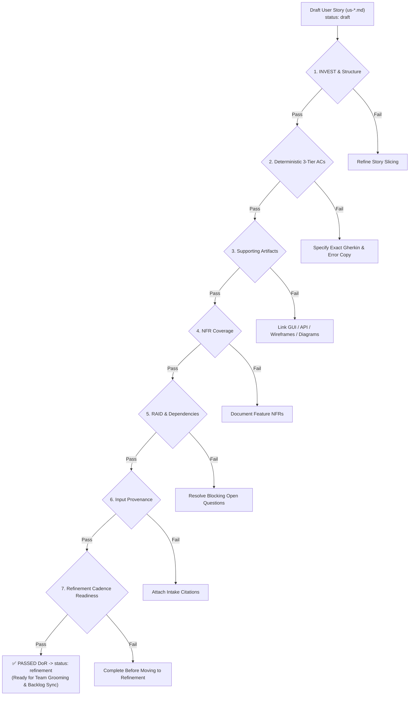

# Definition of Ready (DoR) - In-Repo Standard

This document is the **Single Source of Truth (SSOT)** for evaluating whether a User Story and its supporting requirement artifacts are complete, unambiguous, and ready for Agile Scrum Sprint Planning and AI Spec-Driven Development (AI-SDD).

> [!NOTE]
> **Boundary Note**: Technical Architecture (TA/TL) reviews and contractual Client Sign-Offs are conducted outside this repository. This document governs all **in-repo requirement quality, structural completeness, traceability, and AI-executable testability**.

---

## DoR Evaluation Gate

Before any user story transitions from `status: draft` to `status: refinement` (and becomes eligible for team backlog grooming and sync to Jira/Azure DevOps), it must satisfy all 7 in-repo DoR criteria below.

---

## The 7 In-Repo DoR Criteria

### 1. User Story Structure & INVEST Compliance

- [ ] **Compulsory Parent Epic**: The story frontmatter specifies `epic: <Epic Name>` and is indexed in the parent `<epic-slug>/epic.md`.
- [ ] **Standard Story Statement**: Follows `As a <persona/user role>, I want to <user goal>, so that I can <business value>`.
- [ ] **Business Value Grounded**: Clearly states _why_ the feature exists for the user/business. It is never phrased as a technical chore (e.g., "Create database migration", "Set up API gateway").
- [ ] **Independent & Small**: Sized to $\le 1$ week of delivery effort (fits safely inside a single Scrum sprint) without circular dependencies on other in-flight stories.

### 2. Acceptance Criteria: 3-Tier Structure & Heuristic Comprehensiveness (AI-SDD Ready)

- [ ] **Vertical 3-Tier Layering**:
  - **Tier 1 (Core Functional Journeys)**: Primary nominal success flow, valid alternative user workflows, and entry variations.
  - **Tier 2 (Business Rules & Boundary Conditions)**: Domain logic rules, ZOMBIES boundary limits (zero/empty values, min/max caps), negative input validation blocks, and cascading side-effects.
  - **Tier 3 (Security, State & Technical Exceptions)**: Authorization gates, CRUD+L lifecycle state conflict blocks (e.g. actions on archived, suspended, or locked records), and backend/service failure handling.
- [ ] **Horizontal Comprehensiveness Audit**:
  - **ZOMBIES Boundary Check**: Evaluated Zero conditions (empty/0 values) and Boundary limits (min/max thresholds, caps) with exact quote-delimited error messages.
  - **CRUD+L Lifecycle State Check**: Explicitly captured restrictions on conflicting entity states (e.g., actions on `Archived`, `Suspended`, `Locked`, or `Completed` records).
  - **Ripple & Cascading Dynamics**: Captured side-effects where changing one parameter invalidates or resets another (e.g., changing shipping country resets shipping method and clears invalid promo code).
- [ ] **Clean Gherkin Fenced Code Blocks**: All AC scenarios are enclosed in clean `gherkin ` code blocks containing the `Given`, `When`, `Then`, and `And` steps, omitting redundant `Scenario:` lines.
- [ ] **Exact Quote-Delimited Error Copy**: Every validation error, business block, or exception explicitly quotes the exact user-facing message text (e.g., `Then the system blocks action and displays exact error message: "Account number must be 10 digits."`).
- [ ] **Deterministic Assertions**: All `Then` steps are verifiable and deterministic (state changes, exact copy, UI element visibility, response codes). Zero subjective adjectives (e.g., "fast", "intuitive", "cleanly").

### 2a. Semantic Testability

- [ ] **Semantic Predicate Definitions**: Every business qualifier in a `Given`, `When`, `Then`, or `And` step (for example, `valid`, `complete`, `generic`, `available`, or `successful`) has observable boundary conditions in the story or a linked authoritative source.
- [ ] **Routing Decision Table**: Any fallback, precedence, classification, or routing behavior has a decision table covering input state, observable condition, selected path, and expected outcome.

### 3. Supporting Artifact Linkages

- [ ] **Screen / UI Impact**: If the story touches a user interface, it references an implementation-ready GUI specification (`gui-<screen-slug>.md`) and wireframe (`./wireframes/`).
- [ ] **API / Backend Impact**: If the story defines an API contract, it references an approved API specification (`api-<api-slug>.md`).
- [ ] **Process / Workflow Flow**: If the story involves state transitions or multi-step logic, it references a workflow diagram (`./diagrams/`).
- [ ] **Zero Dead Links**: All relative Markdown links resolve to real files within the workspace.

### 4. Non-Functional Requirements (NFR) Coverage

- [ ] **Feature-Specific NFRs Documented**: Story contains an explicit `Non-functional Requirements` table capturing any story-specific performance (SLA/latency), security (PII/field encryption), audit logging, or accessibility constraints.
- [ ] **Platform NFR Alignment**: If no story-specific NFR is needed, the table confirms adherence to global platform NFR standards (e.g., standard authentication, global response threshold).

### 5. RAID & Dependency Resolution

- [ ] **Pre-conditions Defined**: System, configuration, or user permission prerequisites are clearly documented.
- [ ] **Zero Blocking Open Questions**: All material questions impacting scope, logic, or acceptance criteria are resolved (`Status: Resolved`). Zero blocking questions remain in the `Open Questions` table.
- [ ] **Dependencies Cleared**: All prerequisite services, external APIs, and prerequisite stories are identified with owners and target delivery readiness.

### 6. Input Provenance & Traceability

- [ ] **Intake Provenance**: The `Citations` table identifies the source brief, client ticket, meeting notes, or intake document in `.agent-artifacts/requirements/input/` from which the story originated.

### 7. Refinement Cadence & Readiness Cutoff

- [ ] **Cutoff Prior to Backlog Refinement**: All above criteria must be satisfied so the story enters Backlog Refinement with a complete, structured specification, giving the development team stable material for estimation and sizing.

---

## Status Lifecycle Mapping

| Frontmatter Status   | Meaning in DoR Lifecycle                                                                                                        |
| -------------------- | ------------------------------------------------------------------------------------------------------------------------------- |
| `status: draft`      | Story is actively being authored or elicited by the BA; DoR checks incomplete.                                                  |
| `status: refinement` | **Passed all in-repo DoR checks.** Story specification is complete, robust, and ready for team backlog grooming and estimation. |
| `status: signed-off` | Formally reviewed and accepted by team and stakeholders for active sprint execution.                                            |
