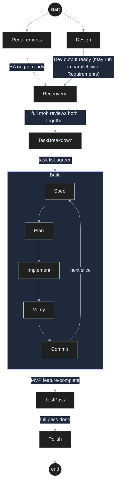

# SDLC Workflow

How BA, Dev, and Test hand off to each other across the day. This is the operational detail behind workshop Part 04 (Mob Working).

## Stage flow

| Stage                               | Lead       | Mode                                              | Output (committed to repo)                                                                            | Handoff trigger                             |
| ----------------------------------- | ---------- | ------------------------------------------------- | ----------------------------------------------------------------------------------------------------- | ------------------------------------------- |
| Requirements                        | BA + Test  | Breakout OK                                       | `docs/stories/{story-id}/requirement.md` — BA writes `[BA]` criteria, Test co-authors `[QC]` criteria | "Requirements ready for design."            |
| Design / SAD                        | Dev        | Breakout OK — parallel with Requirements          | `docs/design/`                                                                                        | Architecture agreed                         |
| _(reconvene)_                       | All        | Full mob                                          | —                                                                                                     | Both outputs reviewed together              |
| Task breakdown                      | Dev        | Full mob                                          | `docs/stories/{story-id}/plan.md` + `tasks.md`                                                        | Task list agreed by mob                     |
| Build (spec-driven loop, per slice) | Dev + Test | Full mob                                          | Working code + tests                                                                                  | MVP feature-complete                        |
| Test pass                           | Test       | Breakout OK to draft strategy; full mob to review | `docs/testing/`, `docs/stories/{story-id}/testcase.md`                                                | "Test pass complete — ready for demo prep." |
| Polish + demo prep                  | All        | Full mob                                          | Stable build, demo script, `docs/token-log.md`                                                        | End of day                                  |

Every transition is a one-line update to [`state/current-stage.md`](../state/current-stage.md) — that's what tells the core agent which persona file to apply next. A breakout only ends once the full team has reviewed its output together; `mode` flips back to `mob` at that point, never before.

## The inner loop: Spec-Driven Development

Within the **Build** stage, every feature slice runs this loop before moving to the next slice:

| #   | Step       | What happens                                                                                        | Skill                                                                                                              |
| --- | ---------- | --------------------------------------------------------------------------------------------------- | ------------------------------------------------------------------------------------------------------------------ |
| 1   | **Spec**   | Describe the behavior and acceptance criteria, pulled from `docs/stories/{story-id}/requirement.md` | —                                                                                                                  |
| 2   | **Plan**   | The agent proposes an approach and a task list; **the mob reviews it before any code is typed**     | [`dev-planning`](../skills/dev-planning/SKILL.md)                                                                  |
| 3   | **Build**  | The agent works the task list one task at a time; navigators review each change                     | [`dev-implementation`](../skills/dev-implementation/SKILL.md)                                                      |
| 4   | **Verify** | Write tests, self-review, run build + tests; fix failures before moving on                          | [`dev-unit-testing`](../skills/dev-unit-testing/SKILL.md), [`dev-code-review`](../skills/dev-code-review/SKILL.md) |
| 5   | **Commit** | Small, working commit with a clear message                                                          | —                                                                                                                  |

Then back to step 1 for the next slice.

Test's persona is active throughout this loop, not just at the dedicated `test-pass` stage — each slice gets tests as it lands.

## Stage diagram

## Definition of Done (per feature slice)

- [ ] Meets acceptance criteria
- [ ] Build passes
- [ ] Tests written and passing
- [ ] Artifacts updated and committed

## Team customizes

Optional — the stage flow works as written.

- [ ] Any stage your topic needs that isn't listed (e.g. a data-migration stage for a rental-scheduler MVP)
- [ ] Realistic time-box per stage, given your total mob-working duration
